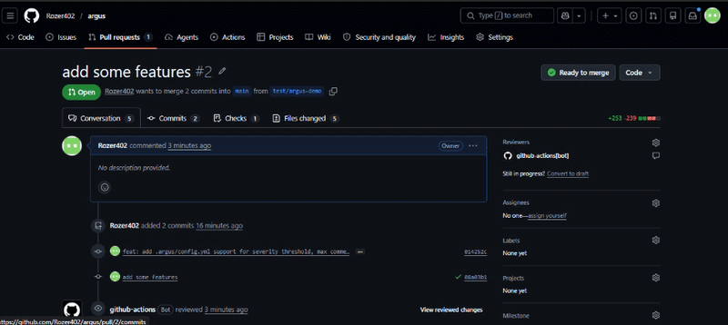

<div align="center">
  
  <br/>
  <br/>

  
  
  
  
  
  

  <br/>
  <br/>

  <p><strong>Argus is a GitHub Action that automatically reviews every pull request using Groq's Llama 3.3 70B — posting inline code comments the moment a PR is opened.<br/>No servers. No cost. No setup beyond a single API key.</strong></p>

  <br/>

  <a href="#-quick-setup">Get Started</a> &nbsp;·&nbsp;
  <a href="#-how-it-works">How It Works</a> &nbsp;·&nbsp;
  <a href="#-example-output">Example Output</a> &nbsp;·&nbsp;
  <a href="#%EF%B8%8F-configuration">Configuration</a> &nbsp;·&nbsp;
  <a href="#-roadmap">Roadmap</a>

  <br/>
  <br/>

</div>



---

## ✨ What Argus does

When a developer opens or updates a pull request, Argus:

1. **Fetches the diff** of every changed file via the GitHub REST API
2. **Filters out noise** — lock files, images, minified JS, and removed files are skipped automatically
3. **Sends each file's patch** to Groq's Llama 3.3 70B with a structured review prompt
4. **Posts inline comments** directly on the PR — pinned to the exact lines with issues
5. **Summarises the review** with an overall risk level and a one-line description of the PR

All of this runs on GitHub's free compute. Your repo. Your rules. Zero infrastructure.

---

## 📸 Example output

A PR is opened with a bug — Argus catches it and posts an inline comment automatically:

```
📍 src/auth.js  line 42

  🤖 Argus — Potential null reference: `user.token` is accessed
  without a null check on `user`. If the login call fails and returns
  null, this will throw at runtime.
```

**Review summary posted on every PR:**

```
## 👁️ Argus Review Summary

| | |
|---|---|
| Files reviewed | 4 |
| Issues found | 2 |
| Risk level | 🟡 Medium |

> This PR adds JWT authentication to the login route and refactors
> the user model to support OAuth providers.
```

---

## ⚡ Quick setup

### Step 1 — Add Argus to any repo you want reviewed

Create `.github/workflows/argus.yml` inside that repo:

```yaml
name: Argus Code Review

on:
  pull_request:
    types: [opened, synchronize, reopened]

permissions:
  pull-requests: write
  contents: read

concurrency:
  group: argus-${{ github.event.pull_request.number }}
  cancel-in-progress: true

jobs:
  review:
    runs-on: ubuntu-latest
    steps:
      - uses: actions/checkout@v4

      - name: Run Argus
        uses: Rozer402/argus@v1
        with:
          groq_api_key: ${{ secrets.GROQ_API_KEY }}
```

### Step 2 — Add your Groq API key

In your repo → **Settings → Secrets and variables → Actions → New repository secret**

| Name | Value |
|---|---|
| `GROQ_API_KEY` | Your key from [console.groq.com](https://console.groq.com) — free tier, no credit card |

> `GITHUB_TOKEN` is provided by GitHub automatically. You do not need to add it.

### Step 3 — Open a pull request

That's it. Argus reviews the next PR automatically. No restarts, no deploys, no config files.

---

## 🔧 How it works

```
PR opened or updated
        │
        ▼
GitHub Actions triggers argus.yml
        │
        ▼
Fetch PR diff  ────────────────────────▶  GitHub REST API
        │                                 (pulls.listFiles)
        ▼
Filter irrelevant files
(*.lock, *.png, *.min.js, removed files)
        │
        ▼
Build review prompt per file  ─────────▶  Groq API
                                           Llama 3.3 70B
        │
        ◀──────────────────────────────────  JSON array of comments
        │
        ▼
Post inline comments  ─────────────────▶  GitHub REST API
+ summary comment                          (pulls.createReview)
```

**The model is instructed to:**
- Flag bugs, null reference risks, missing error handling, and security issues
- Skip formatting, naming conventions, and style opinions
- Return structured JSON — not freeform text — so every comment maps to an exact line number

---

## 📁 Project structure

```
argus/
├── action.yml                   # GitHub Action metadata and inputs
├── package.json
├── argus-logo.svg               # Project logo
├── src/
│   ├── index.js                 # Entry point — orchestrates the full review flow
│   ├── github.js                # GitHub REST API — fetch diff, post comments
│   ├── groq.js                  # Groq API — sends prompt, parses JSON response
│   └── prompts.js               # Prompt templates for file review and PR summary
└── .github/
    └── workflows/
        └── review.yml           # Self-review — Argus reviews its own PRs
```

---

## ⚙️ Configuration

The `with:` block in your workflow accepts these inputs:

| Input | Required | Default | Description |
|---|---|---|---|
| `groq_api_key` | ✅ Yes | — | Your Groq API key |

Built-in defaults (not yet configurable — see [Roadmap](#-roadmap)):

| Behaviour | Default |
|---|---|
| Model | `llama-3.3-70b-versatile` |
| Max tokens per file | `1024` |
| Temperature | `0.1` (consistent, structured output) |
| Max files per PR | `50` |
| Files skipped | `*.lock`, `*.min.js`, `*.png`, `*.jpg`, `*.svg`, `package-lock.json` |
| Review focus | Bugs · Security · Null safety — no style comments |

Optional per-repo config file (place in the reviewed repo, not the Argus repo):

| File | Required | Default | Description |
|---|---|---|---|
| `.argus/config.yml` | ❌ No | — | Optional config file for severity threshold, max comments, ignore paths |

---

## 🌐 Use in your own projects

Argus works on **any repo**, not just this one. Add the workflow file from [Quick Setup](#-quick-setup) to any repository you own. One API key works across all of them.

```
Your org
 ├── frontend-app      ← add .github/workflows/argus.yml
 ├── backend-api       ← add .github/workflows/argus.yml
 └── mobile-app        ← add .github/workflows/argus.yml
```

All three repos now get automatic AI review on every PR — same key, same action, zero extra setup.

---

## 🗺️ Roadmap

- [ ] Configurable model via `action.yml` input
- [ ] Per-language prompt specialisation (stricter for Python, relaxed for config files)
- [ ] `.argusignore` support for skipping custom file paths
- [x] Severity levels — `CRITICAL`, `WARNING`, `SUGGESTION`, `INFO` (v1.2.0)
- [ ] Review history saved as a downloadable Action artifact
- [ ] Auto-chunking for large diffs to avoid token limits
- [ ] GitHub Marketplace listing

---

## 🛠️ Local development

Clone and install:

```bash
git clone https://github.com/Rozer402/argus.git
cd argus
npm install
```

Create a `.env` file for local testing:

```env
GITHUB_TOKEN=your_github_token
GROQ_API_KEY=your_groq_key
GITHUB_REPOSITORY=Rozer402/argus
PR_NUMBER=1
GITHUB_SHA=your_commit_sha
```

Run against a real PR:

```bash
node src/index.js
```

---

## 🤝 Contributing

Pull requests are welcome. For major changes please open an issue first.

1. Fork the repo
2. Create a branch: `git checkout -b feat/your-feature`
3. Commit: `git commit -m "feat: add your feature"`
4. Push and open a PR — Argus will review it automatically

---

## 📄 License

MIT © [Aditya Bhusal](https://github.com/Rozer402)

---

<div align="center">


<br/>

Built with [Groq](https://groq.com) &nbsp;·&nbsp; Runs on [GitHub Actions](https://github.com/features/actions) &nbsp;·&nbsp; Free forever

<br/>

<sub><i>Named after Argus Panoptes — the hundred-eyed giant of Greek mythology who never slept.</i></sub>

</div>